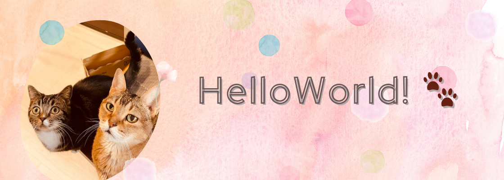
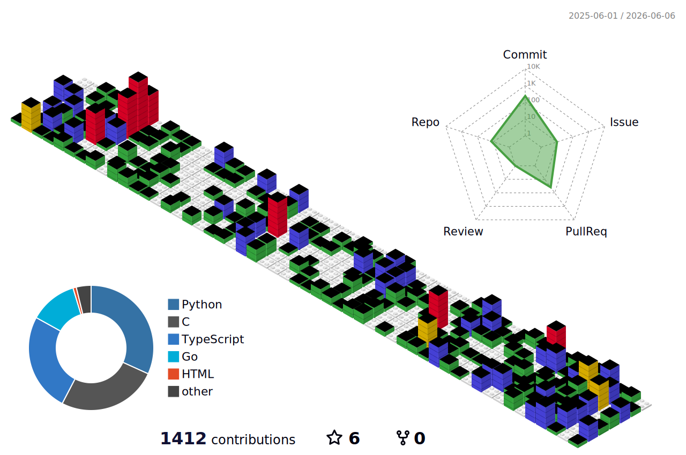

## Hi there 👋





```go
package main

type Developer struct {
    Name          string
    Communities   []string
    Experiences   []string
    Hobbies       []string
    Cats          []struct {
        Name string
        Role string
    }
}

func NewDeveloper() *Developer {
    return &Developer {
        Name: "Misato Kawano 👵",
        Communities: []string {
            "SingularitySociety 🚀",
            "WomenWhoGo Tokyo 🦫",
            "42 Tokyo 🎮",
            "Raycast Community Japan 🦝",
        },
        Experiences: []string {
            "System Development 💻",
            "Infrastructure Management 🛠️",
            "BI & Data Operations 📊",
            "Security Product Support 🔐",
            "Support Center Leadership 🎯",
        },
        Hobbies: []string {
            "Mountain Climbing 🏔️",
            "City Walking 🚶‍♀️",
            "Knitting 🧶",
            "Piano 🎹",
            "Tennis 🎾",
        },
        Cats: []struct {
            Name string
            Role string
        }{
            { Name: "Nyan1-Go", Role: "Senior Bug Hunter 🐱" },
            { Name: "Nyan2-Go", Role: "Chief Nap Officer 🐱" },
        },
    }
}
```

<!--
**mikkegt/mikkegt** is a ✨ _special_ ✨ repository because its `README.md` (this file) appears on your GitHub profile.

Here are some ideas to get you started:

- 🔭 I’m currently working on ...
- 🌱 I’m currently learning ...
- 👯 I’m looking to collaborate on ...
- 🤔 I’m looking for help with ...
- 💬 Ask me about ...
- 📫 How to reach me: ...
- 😄 Pronouns: ...
- ⚡ Fun fact: ...
-->
