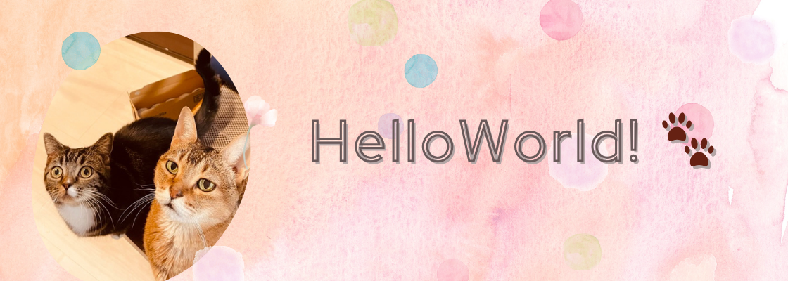
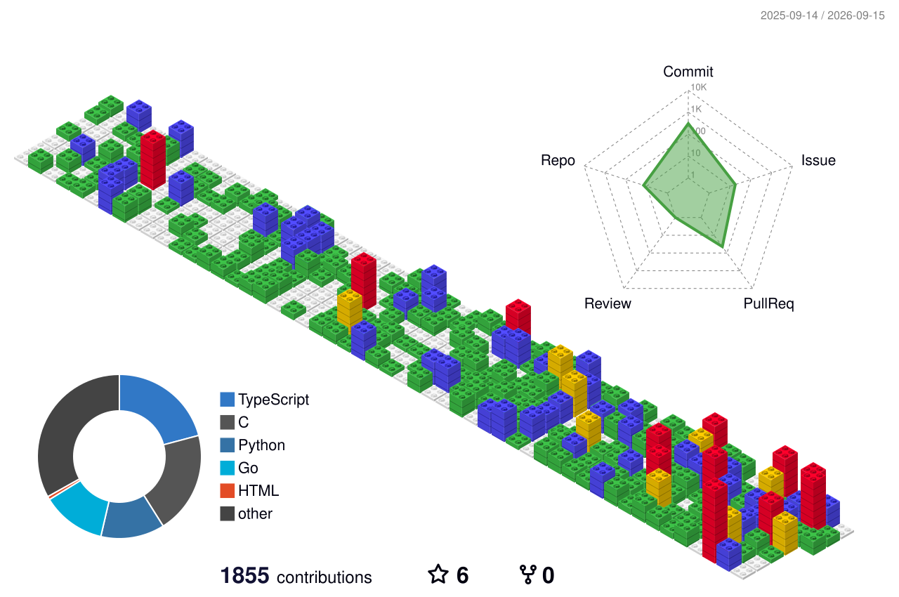

## Hi there 👋



```go
package main

// Misato Kawano — 25+ yrs in IT, still runs `git commit` for fun
var Misato = Engineer{
	Now: []string{
		"🔮 AI Engineer — prompt design / RAG / LLM eval",
		"📚 Re-learning CS @ 42 Tokyo — C/C++ systems programming",
		"🐏 Living in Claude Code as a daily driver",
	},
	Experience:  "25+ yrs — Dev / Infra / Data / Support / Security",
	Domains:     []string{"Automotive", "Finance", "SI", "Security products"},
	Languages:   []string{"C", "C++", "Go", "C#", "Python", "TypeScript", "Java", "SQL"},
	Cloud:       []string{"OCI", "AWS"},
	Data:        []string{"PostgreSQL", "Oracle", "Snowflake"},
	Communities: []string{"Singularity Society 🚀", "Women Who Go Tokyo 🦫", "42 Tokyo 🎮"},
	OSS:         []string{"ownplate — QA & dev (Vue / Tailwind / Firebase)"},
}
```

<!--
**mikkegt/mikkegt** is a ✨ _special_ ✨ repository because its `README.md` (this file) appears on your GitHub profile.

Here are some ideas to get you started:

- 🔭 I’m currently working on ...
- 🌱 I’m currently learning ...
- 👯 I’m looking to collaborate on ...
- 🤔 I’m looking for help with ...
- 💬 Ask me about ...
- 📫 How to reach me: ...
- 😄 Pronouns: ...
- ⚡ Fun fact: ...
-->
